# MobileHapticFeedback

**MobileHapticFeedback** は、Unity 向けの  
**クロスプラットフォーム・ハプティックフィードバックライブラリ**です。

iOS（Core Haptics / UIKit）と Android（VibrationEffect）を対象に、  
統一された API でハプティック表現を扱うことができます。

UIKit スタイルの簡易フィードバックから、  
パラメータ指定のワンショットインパクト、  
波形ベースのパターン再生までをサポートしています。

## 特徴

- **iOS**
  - Core Haptics（CHHapticEngine）によるインパクト再生
  - UIKit 準拠のハプティック（Impact / Selection / Notification）
- **Android**
  - VibrationEffect ベースのハプティック（API 26+）
- **Unity**
  - プラットフォーム共通の統一 API
  - ハプティックが無効な場合でも安全に no-op 動作

> **⚠️ 補足（Android）**  
> UIKit スタイルおよび Core Haptics 風 API は、  
> Android で利用可能な振動表現に概念的にマッピングされています。

## 対応プラットフォーム

- iOS 13 以上
- Android API 26 以上
- Unity 6000.0 以上

## インストール（Unity Package Manager）

Git URL を指定して追加します。
```
https://github.com/tsyk5/MobileHapticFeedback.git?path=package/com.tsyk5.mobilehapticfeedback
```

特定バージョンを指定する場合はタグを付与してください。
```
https://github.com/tsyk5/MobileHapticFeedback.git?path=package/com.tsyk5.mobilehapticfeedback#v0.1.1
```

## クイックスタート

### UIKit 風 API

```csharp
MobileHapticFeedback.PlayImpact(ImpactStyle.Medium);
MobileHapticFeedback.PlaySelection();
MobileHapticFeedback.PlayNotification(NotificationType.Success);
```
これらの API は可用性チェックなしで安全に呼び出せます。

OS やユーザー設定でハプティックが無効な場合は、何も起きません。

### Core Haptics 風 API

```csharp
MobileHapticFeedback.Prepare();
MobileHapticFeedback.PlayImpact(intensity: 0.6f, sharpness: 0.3f, durationSec: 0.2);

MobileHapticFeedback.Stop();
```
パラメータ
- `intensity` (0..1): ハプティックの強度
- `sharpness` (0..1): 鋭さ（iOS のみ）
- `durationSec` (sec): 再生時間

> ⚠️ 補足（Android）<br>
> Android では sharpness はサポートされていません。<br>
> 値を変更しても振動の挙動は変化しません。

### Patterns API（波形スタイル）

```csharp
MobileHapticFeedback.Prepare();


var durationsSec = new float[]
    {
        0.6f, 0.15f
    };
var amplitudes = new float[]
    {
        0.1f, 0f
    }
MobileHapticFeedback.PlayPattern(durationsSec,amplitudes);
```
パラメータ

- durations (sec): 各セグメントの再生時間
- amplitudes (0..1): 各セグメントの強度。`0` は無音、`1`は最大強度

## サンプル（Sample01）

Sample01 シーンでは、以下のハプティックパターンを確認できます。

シーンをビルド後、各セクションのボタンを押すことで、
実機上でハプティックの挙動を確認できます。

> ⚠️
><br/>Unity Editor 上ではハプティックは再生されません。<br/>
>必ず実機で確認してください。

### ⭐️ Core Haptics 風 API（ワンショットインパクト）

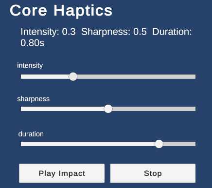

スライダーで各パラメータを調整し、**「Play Impact」** を押してください。  
再生中に **「Stop」** を押すことで、Duration の途中でも即座に停止できます。

---

### ⭐️ Patterns API（波形スタイル）

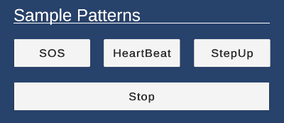

**Duration（時間）** と **Amplitude（強度）** を明示的に組み合わせることで、  
任意のパターンを作成できます。

すべてのパターンは、再生途中でも **「Stop」** で中断できます。

---

### SOS


モールス信号の **SOS（… --- …）** をハプティックで表現しています。  
短いパルス（dit）と長いパルス（dah）を組み合わせた、認識しやすいパターンです。

---

### Heartbeat

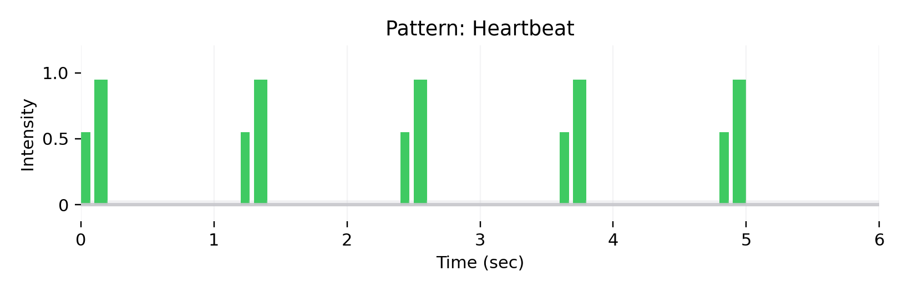

人間の **心臓の鼓動** をイメージしたリズミカルなパターンです。  
ダブルパルスと休止により、生体的なリズム感を表現します。

---

### StepUp

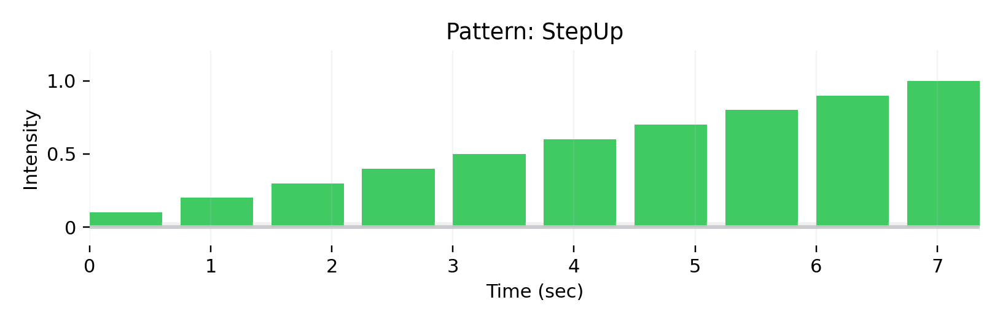

強度が徐々に上がっていくパターンです。  
盛り上がり、進行、強調表現などに向いています。

---

### ⭐️ UIKit 風 API

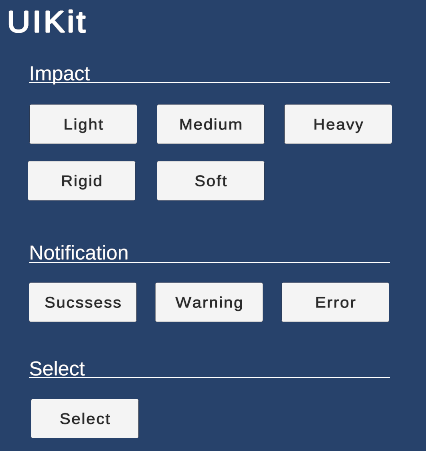

UIKit スタイルのハプティックは、Apple が定義している **システム標準の挙動** に準拠します。 
 
公式の設計意図や図は、以下のドキュメントを参照してください：

<a href="https://developer.apple.com/jp/design/human-interface-guidelines/playing-haptics">
Apple – Human Interface Guidelines / Playing Haptics
</a>

---

## UIKit – Impact Styles

### Light

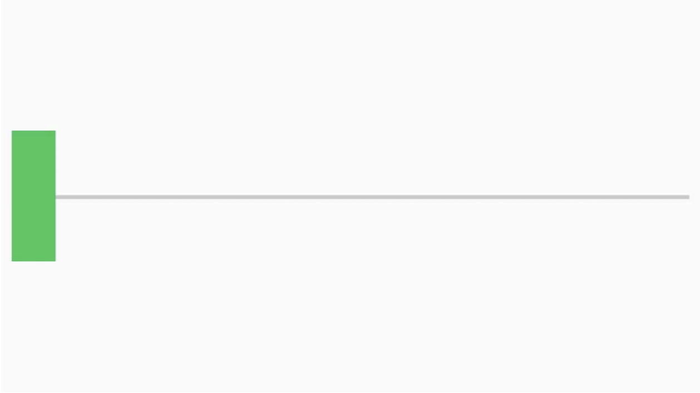

小さい/軽いUIオブジェクト同士の衝突を知らせます。

### Medium

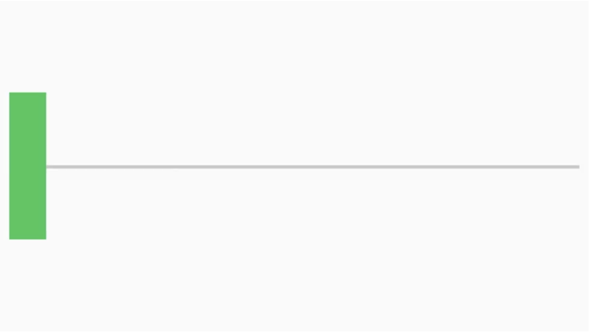

中くらいのサイズ/重さのUIオブジェクト同士の衝突を知らせます。

### Heavy

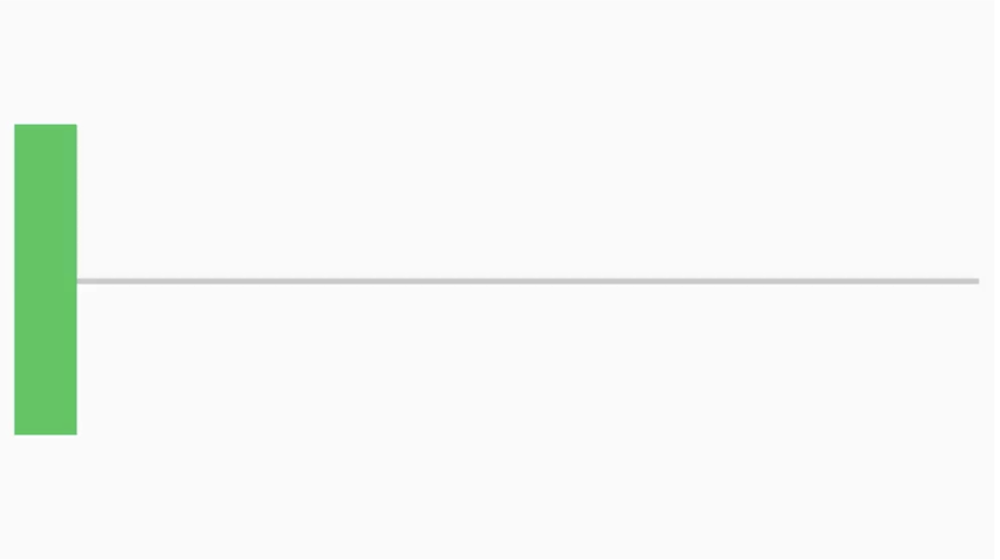

大きい/重いUIオブジェクト同士の衝突を知らせます。

### Soft

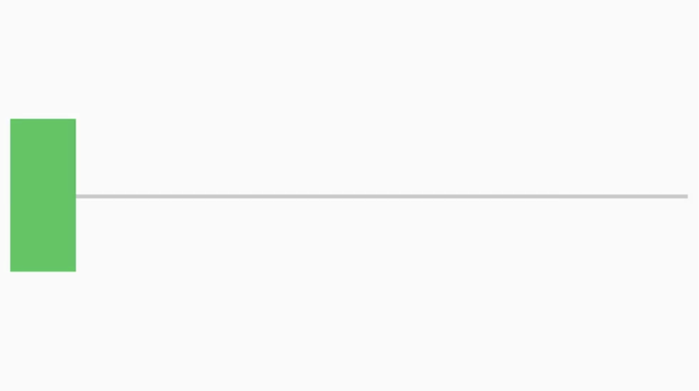

柔らかい/弾力性のあるUIオブジェクト同士の衝突を知らせます。

### Rigid

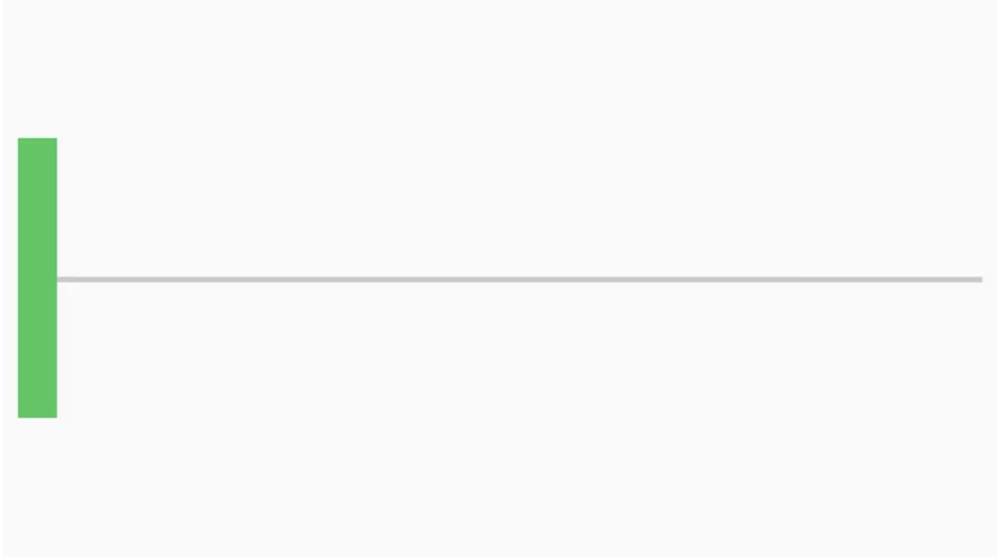

硬い/弾力性のないUIオブジェクト同士の衝突を知らせます。

### Success

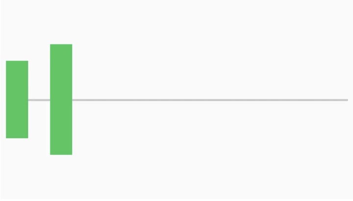

タスクやアクションが完了したことを知らせます。

### Warning

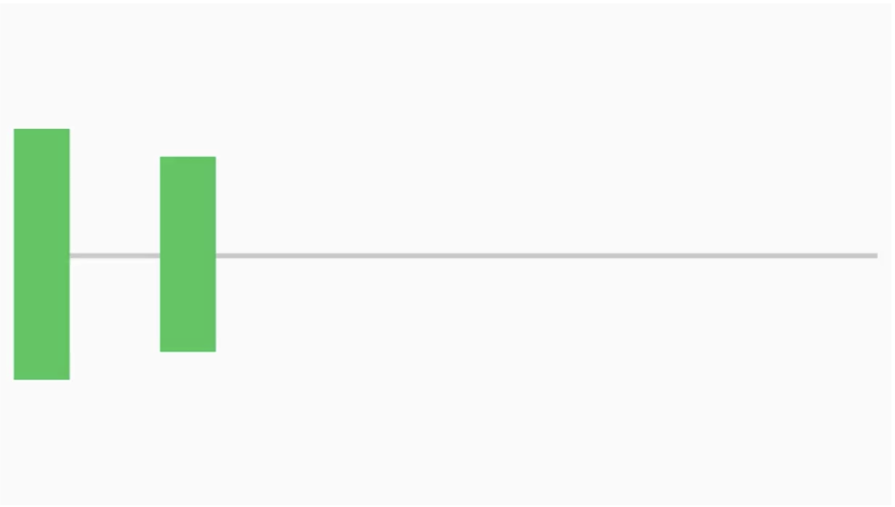

タスクやアクションで何らかの警告が発生したことを知らせます。

### Error

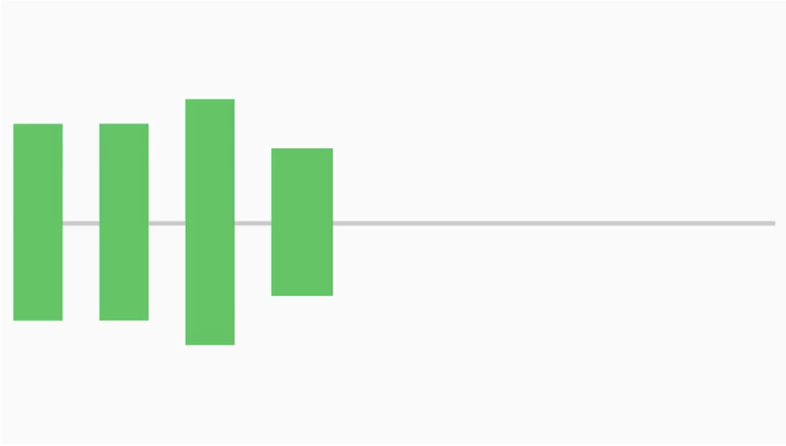

 エラーが起きたことを知らせます。

### Selection

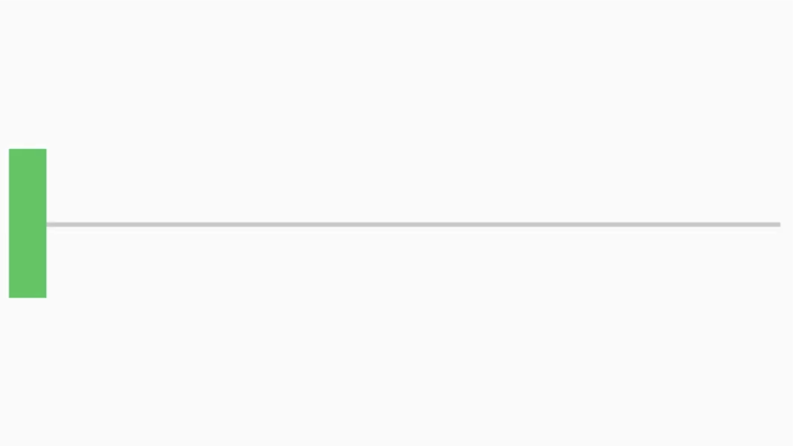

UI要素の値が変化したことを知らせます。

## ライセンス

MIT