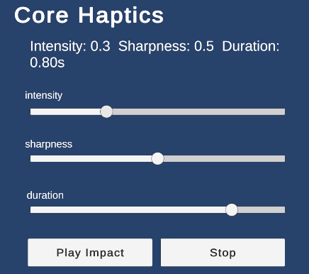
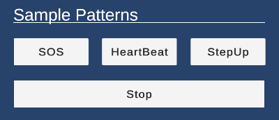
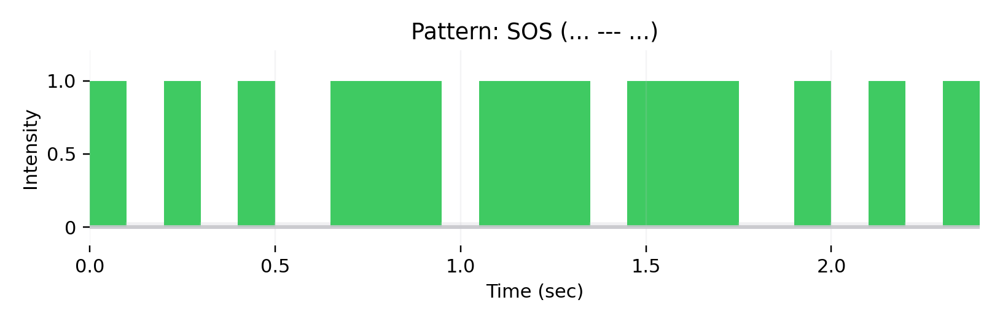
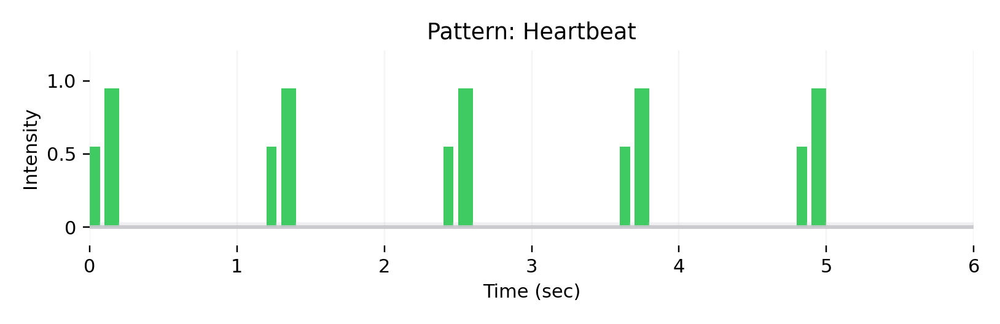
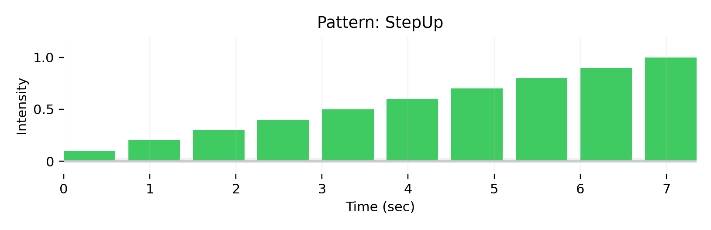
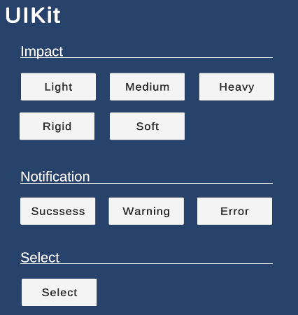

# MobileHapticFeedback

**MobileHapticFeedback** は、Unity 向けの  
**クロスプラットフォーム・ハプティックフィードバックライブラリ**です。

iOS（Core Haptics / UIKit）と Android（VibrationEffect）を対象に、  統一された API でハプティック表現を扱うことができます。

UIKit スタイルの簡易フィードバックから、  パラメータ指定のワンショットインパクト、  波形ベースのパターン再生までをサポートしています。

## 特徴

- **iOS**
  - Core Haptics（CHHapticEngine）によるインパクト再生
  - UIKit 準拠のハプティック（Impact / Selection / Notification）
- **Android**
  - VibrationEffect ベースのハプティック（API 26+）
  - エンベロープベースのインパクト / パターン再生と sharpness 対応（Android 16 以上の対応端末）
- **Unity**
  - プラットフォーム共通の統一 API
  - ハプティックが無効な場合でも安全に動作

> **⚠️ 補足（Android）**  
> UIKit スタイルおよび Core Haptics 風 API は、  
> Android で利用可能な振動表現に概念的にマッピングされています。

## 対応プラットフォーム

- iOS 13 以上
- Android API 26 以上
- Unity 6000.0 以上

## インストール（Unity Package Manager）

Git URL を指定して追加します。
```
https://github.com/tsyk5/MobileHapticFeedback.git?path=package/com.tsyk5.mobilehapticfeedback
```

特定バージョンを指定する場合はタグを付与してください。
```
https://github.com/tsyk5/MobileHapticFeedback.git?path=package/com.tsyk5.mobilehapticfeedback#v0.4.0
```

## クイックスタート

### UIKit 風 API

```csharp
MobileHapticFeedback.PlayImpact(ImpactStyle.Medium);
MobileHapticFeedback.PlaySelection();
MobileHapticFeedback.PlayNotification(NotificationType.Success);
```
これらの API は可用性チェックなしで安全に呼び出せます。

OS やユーザー設定でハプティックが無効な場合は、何も起きません。

### Core Haptics 風 API

```csharp
MobileHapticFeedback.Prepare();
MobileHapticFeedback.PlayImpact(intensity: 0.6f, sharpness: 0.3f, durationSec: 0.2);

MobileHapticFeedback.Stop();
```
パラメータ
- `intensity` (0..1): ハプティックの強度
- `sharpness` (0..1): 鋭さ
- `durationSec` (sec): 再生時間（0.01〜10秒にclamp。`MinDurationSec` / `MaxDurationSec` 参照）

> ⚠️ 補足（Android）<br>
> `sharpness` が効くのは、エンベロープ効果（`VibrationEffect.BasicEnvelopeBuilder`）に対応した Android 16 以上の端末のみです。<br>
> それ以外の端末では値は無視されます。実行時に `MobileHapticFeedback.IsSharpnessSupported` で判定できます。

### Patterns API（波形スタイル）

```csharp
MobileHapticFeedback.Prepare();

// PatternSegment 1つ = (durationSec, amplitude)
MobileHapticFeedback.PlayPattern(
    new PatternSegment(0.6f, 0.1f),
    new PatternSegment(0.15f, 0f)   // amplitude 0 = 無音
);
```
パラメータ

- `durationSec` (sec): セグメントの再生時間
- `amplitude` (0..1): セグメントの強度。`0` は無音、`1`は最大強度

> `PlayPattern(float[] durationsSec, float[] amplitudes)` は v0.4.0 で非推奨になりました。
> 2本の配列の要素数がズレてもコンパイルが通り、サイレントに失敗するためです。

## サンプル（Sample01）

Sample01 シーンでは、以下のハプティックパターンを確認できます。

シーンをビルド後、各セクションのボタンを押すことで、
実機上でハプティックの挙動を確認できます。

> ⚠️
><br/>Unity Editor 上ではハプティックは再生されません。<br/>
>必ず実機で確認してください。

### ⭐️ Core Haptics 風 API（ワンショットインパクト）



スライダーで各パラメータを調整し、**「Play Impact」** を押してください。  
再生中に **「Stop」** を押すことで、Duration の途中でも即座に停止できます。

---

### ⭐️ Patterns API（波形スタイル）



**Duration（時間）** と **Amplitude（強度）** を明示的に組み合わせることで、  
任意のパターンを作成できます。

すべてのパターンは、再生途中でも **「Stop」** で中断できます。

### SOS



モールス信号の **SOS（… --- …）** をハプティックで表現しています。  
短いパルス（dit）と長いパルス（dah）を組み合わせた、認識しやすいパターンです。

### Heartbeat



人間の **心臓の鼓動** をイメージしたリズミカルなパターンです。  
ダブルパルスと休止により、生体的なリズム感を表現します。

### StepUp



強度が徐々に上がっていくパターンです。  
盛り上がり、進行、強調表現などに向いています。

### ⭐️ UIKit 風 API



UIKit スタイルのハプティックは、Apple が定義している **システム標準の挙動** に準拠しています。 
 
公式の設計意図や図は、以下のドキュメントを参照してください：

<a href="https://developer.apple.com/jp/design/human-interface-guidelines/playing-haptics">
Apple – Human Interface Guidelines / Playing Haptics
</a>

## ライセンス

MIT